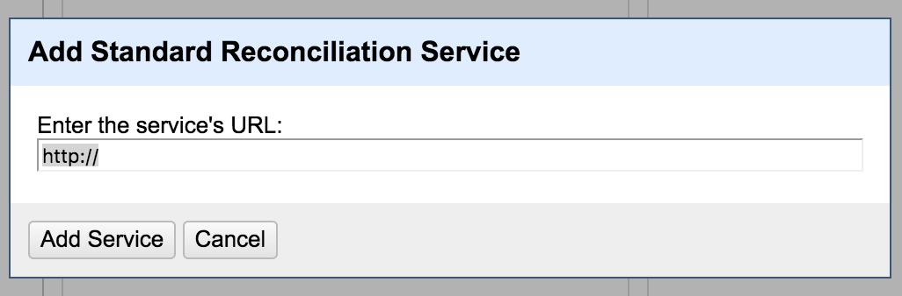

LDAP
====

This reconciler for [OpenRefine](http://openrefine.org/) can match given strings
agains a LDAP directory.

Requirements
------------

You need [Python](https://www.python.org/) (2.7, Python 3 will not work) with
the following modules installed. If you don’t have the modules try to install
them via `pip`. But is recomended that you use the packaging system of your OS
(like `apt-get` on Ubuntu). If you don’t have `pip` try:

~~~~~~~~~~~~~~~~~~~~~~~~~~~~~~~~~~~~~~~~~~~~~~~~~~~~~~~~~~~~~~~~~~~~~~~~~~~~~~~~
python -m easy_install pip
~~~~~~~~~~~~~~~~~~~~~~~~~~~~~~~~~~~~~~~~~~~~~~~~~~~~~~~~~~~~~~~~~~~~~~~~~~~~~~~~

-   [ldap](https://www.python-ldap.org/)  
    `pip install python-ldap`

-   [yaml](http://pyyaml.org/)  
    `pip install PyYAML`

-   flask  
    `pip install Flask`

Usage
-----

### Service

Start the service on the command line, you need to pass a configuration file for
each instance:

~~~~~~~~~~~~~~~~~~~~~~~~~~~~~~~~~~~~~~~~~~~~~~~~~~~~~~~~~~~~~~~~~~~~~~~~~~~~~~~~
python ldap-reconcile.py ldap-users.yml  
~~~~~~~~~~~~~~~~~~~~~~~~~~~~~~~~~~~~~~~~~~~~~~~~~~~~~~~~~~~~~~~~~~~~~~~~~~~~~~~~

After the service has started just add a OpenRefine reconciliation service with
the local URL. This should be `http://localhost:5000/ldap-reconcile` by default.

### OpenRefine

#### Basic usage

Setup a OpenRefine Project, on the column which should the service to be applied
to, select the title arrow (1), then „Reconcile“ (2) and then „Start
reconciling..."

The next step would be adding your local instance of the service to OpenRefine
using the „Add standard service…“ button on the bottom of the page (see the next
but one screen shot).

After the service is added you can use it, notice that takes a bit of time until
you can start, as you might notice OpenRefine is probing the service by sending
a few of your entries. You don’t need to make services here, just hit „Start
Reconciling“ (1).

#### Advanced Usage

Using the service it is also possible to get more data from the directory
server, this can be done by calling the service for each cell of a given column
and use the
[parseJSON](https://github.com/OpenRefine/OpenRefine/wiki/GREL-Other-Functions#parsejsonstring-s)
function from GREL.

Configuration
-------------

There are several possible settings in the configuration file.

### Connection

-   `host` - The LDAP URI for the host

-   `base` - The bind DN

-   `password` - The password

### Service settings

-   `self_port` - The port the service should listen on

### Search settings

-   `search_base` - The base DN to search from, all searches include the whole
    subtree.

-   `exact_match_score` - If this is set, results will be filtered depending on
    their score, 0 means no filtering.

-   `search_filter` - A dictionary which contains the LDAP fiter as a key and
    another dictionary as value. This dictionary has the following keys:

    -   `score` - The score a match will get.

    -   `operation` - A string manipulation which needs to be done for the
        search string is applied to the filter.

    -   `devide_by_matches` - Will divide the score by the number of matches.

    -   `name` - The LDAP attribute the Name is taken from.

-   `id` - Sets which attribute will be used as ID of a possible match.

-   `search_attrs` - A list of attributes to return.

Examples
--------

There are to example configurations provided:

-   `ldap-users.yml` - This example uses the LDAP attributes `gecos`, `name`,
    `cn` for exact matches and also looks for the `sn` attribute but scores
    matches there quite low. Use this example if you need simple string
    manipulations.

-   `ldap-mail.yml` - This example tries to get matches from email addresses.

 
